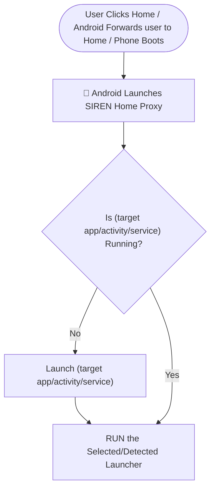

**Intended Flow**

```mermaid
flowchart
    ACTION(["User Clicks Home / Android Forwards user to Home / Phone Boots"]) --> BOOT_START
    BOOT_START["🔄 Android Launches SIREN Home Proxy"] --> QUE{"Is (target app/activity/service) Running?"}
    QUE -- No --> RERUN["Launch (target app/activity/service)"]
    RERUN --> LAUNCH
    QUE -- Yes --> LAUNCH["RUN the Selected/Detected Launcher"]
```
